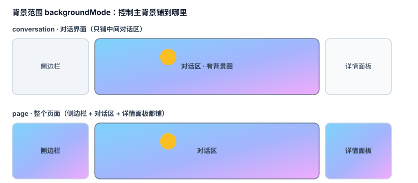
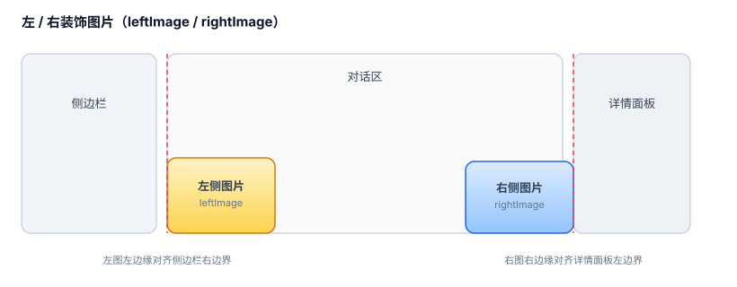
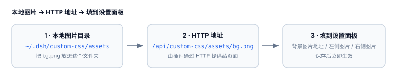

# @runcross/dsh-simple-background

一个 dsh Web 插件：在 **DSH Web 设置**里动态新增 / 修改 CSS，支持背景图片（含本地图片），
并把用户 JavaScript 保存为真实文件后由页面加载执行。

## 功能

- 背景图片：
  - 主背景（URL / data URI / CSS 渐变 / 本地图片；尺寸、位置、重复、不透明度可配；`conversation` 对话界面 / `page` 整个页面二选一）
  - 对话界面模式下可单独设置左侧工作区（侧边栏）背景图
  - 左 / 右装饰图片（`leftImage` / `rightImage`，锚定中间对话区域左右边缘；高度、底部偏移、不透明度可配）
  - 本地图片目录：把本地文件夹里的图片通过 HTTP 提供给页面
- 设置面板新增「自定义样式 / Custom CSS」页面。
- 动态注入 / 移除 `<style>`，保存后立即生效，无需重启 dsh web。
- 可视化 CSS 规则列表（选择器 + 样式声明 + 备注）
- 「插入默认规则」：一键生成带说明的常用 CSS 模板
- 用户 JS 文件：保存到 `$DSH_HOME/custom-css/user.js` 并由页面加载
- 浏览器全局 API：`window.dshCustomCss`

## 安装

开发模式（本地 link）：

```bash
cd /home/Run/workspace/dsh-simple-web-ui2/dsh-custom-css
pnpm install --ignore-scripts

dsh plugin --profile web add /home/Run/workspace/dsh-simple-web-ui2/dsh-custom-css
# 重启 dsh web
dsh web
```

发布/安装为 bundle 后，`dsh plugin add` 会自动把包名加入
`dsh.profile.bundles`；本包的 `dsh.bundle.patch` 会插入插件行。

## 使用

### 打开设置面板

1. 打开 DSH Web 右上/左下「设置」。
2. 进入「自定义样式 / Custom CSS」。
3. 勾选「启用自定义样式」，填写下面的背景配置，点「保存」立即生效。

### 背景图片配置

插件把背景能力分成三层，按需组合：

1. **主背景**（`backgroundImage`）：铺在对话区或整个页面。
2. **左侧工作区背景**（`sidebarBackgroundImage`）：单独给侧边栏换背景。
3. **左 / 右装饰图片**（`leftImage` / `rightImage`）：固定在对话区左下 / 右下角的独立图片。

#### 1. 选择背景范围

「背景范围 / backgroundMode」决定主背景铺到哪里：

- `conversation`（对话界面）：只铺中间对话区，侧边栏和详情面板保持原样。
- `page`（整个页面）：侧边栏 + 对话区 + 详情面板全部铺上。



#### 2. 填写主背景图片地址

「图片地址 / backgroundImage」支持：

- `http(s)://...` 网络图片
- `data:image/...;base64,...` data URI
- CSS 渐变，例如 `linear-gradient(135deg, #7dd3fc, #f0abfc)`
- 本地图片地址 `/api/custom-css/assets/文件名.png`（见下方「本地图片」）

再按需调整「尺寸 / 位置 / 重复 / 不透明度」：

| 字段 | 默认值 | 说明 |
| --- | --- | --- |
| `backgroundSize` | `cover` | 图片尺寸，`cover` / `contain` / `100% 100%` 等 |
| `backgroundPosition` | `center` | 图片位置，`center` / `top left` 等 |
| `backgroundRepeat` | `no-repeat` | 重复方式 |
| `backgroundOpacity` | `1` | 不透明度 0 到 1，例如 `0.5` |

> `backgroundOpacity` 小于 1 时，插件会改用独立图层渲染，避免把整个页面压暗。

#### 3. 左侧工作区背景（可选）

当「背景范围」为 `conversation` 时，可再给左侧工作区（侧边栏）单独设置背景图：

- 「左侧工作区背景 / sidebarBackgroundImage」：图片地址，支持与主背景相同的格式。
- 「左侧背景不透明度 / sidebarBackgroundOpacity」：0 到 1，例如 `0.5`。
- 尺寸 / 位置 / 重复复用主背景的 `backgroundSize` / `backgroundPosition` / `backgroundRepeat`。

#### 4. 左 / 右装饰图片（可选）

在对话区左下角、右下角各放一张独立装饰图片（常用来放吉祥物、边框、LOGO）：



- 「左侧图片 / leftImage」：左边缘自动贴合侧边栏右边界。
- 「右侧图片 / rightImage」：右边缘自动贴合详情面板左边界。
- 每张图可单独设置：
  - 高度 `height`：默认 `clamp(360px, 80vh, 960px)`
  - 底部偏移 `bottom`：默认 `clamp(-24px, -1.6vh, -8px)`
  - 不透明度 `opacity`：0 到 1

#### 5. 本地图片

浏览器页面无法直接读取 `file://` 或任意本地绝对路径，所以插件会把一个本地目录通过
HTTP 提供给页面：



1. 把图片放到「本地图片目录」（默认 `$DSH_HOME/custom-css/assets`，即
   `~/.dsh/custom-css/assets`）。也可以在设置里把 `assetsPath` 改成任意本地文件夹。
2. 在「背景图片地址」「左侧图片」或「右侧图片」里填：

```
/api/custom-css/assets/我的图片.png
```

3. 保存即可。支持子目录：`/api/custom-css/assets/sub/dir/pic.png`（相对于 `assetsPath`）。

## 设置项

| 字段 | 默认值 | 说明 |
| --- | --- | --- |
| `enabled` | `true` | 总开关；关闭时清除插件注入的 CSS/背景/JS 脚本 |
| `css` | `""` | 原始 CSS 文本，直接写入 `<style>` |
| `backgroundImage` | `""` | 背景图 URL、data URI、CSS 渐变或本地图片地址 |
| `backgroundSize` | `cover` | CSS background-size |
| `backgroundPosition` | `center` | CSS background-position |
| `backgroundRepeat` | `no-repeat` | CSS background-repeat |
| `backgroundOpacity` | `1` | 背景图片不透明度，0 到 1（例如 `0.5`） |
| `backgroundMode` | `conversation` | 背景范围：`conversation` 对话界面（中间对话区）、`page` 整个页面（含侧边栏与详情面板），二选一 |
| `sidebarBackgroundImage` | `""` | 左侧工作区（侧边栏）背景图；仅在 `backgroundMode=conversation` 时生效，复用上方 size/position/repeat |
| `sidebarBackgroundOpacity` | `1` | 左侧工作区背景图不透明度，0 到 1（例如 `0.5`） |
| `leftImage` | 对象，见下 | 中间对话区域左下角装饰图片配置：`image`、`height`、`bottom`、`opacity` |
| `rightImage` | 对象，见下 | 中间对话区域右下角装饰图片配置：`image`、`height`、`bottom`、`opacity` |
| `leftImage.height` / `rightImage.height` | `clamp(360px, 80vh, 960px)` / `clamp(340px, 78vh, 940px)` | 侧边图片显示高度 |
| `leftImage.bottom` / `rightImage.bottom` | `clamp(-24px, -1.6vh, -8px)` | 相对对话区域底部的偏移 |
| `leftImage.opacity` / `rightImage.opacity` | `1` | 不透明度，0 到 1 |
| `assetsPath` | `$DSH_HOME/custom-css/assets` | 本地图片目录，由 `/api/custom-css/assets/...` 提供 |
| `rules` | `[]` | 可视化 CSS 规则列表；每条含 `selector`、`css`、`note` |
| `jsEnabled` | `false` | 是否加载用户 JS 文件 |
| `jsCode` | `""` | 保存到 `$DSH_HOME/custom-css/user.js` 的代码 |

## JS 文件与 window.dshCustomCss

设置页中的 JS 代码会写入：

```
$DSH_HOME/custom-css/user.js
```

页面通过 `/api/custom-css/user.js` 加载该文件。你也可以直接编辑这个文件，
刷新页面后生效。可用的帮助函数：

```js
// 直接覆盖插件 CSS（当前会话）
window.dshCustomCss.setCss('#root { border-radius: 16px; }')

// 动态新增 / 修改一条规则
window.dshCustomCss.setRule('[data-slot="sidebar"]', {
  background: '#111827',
  color: '#e5e7eb'
})

// 删除一条规则
window.dshCustomCss.removeRule('[data-slot="sidebar"]')

// 动态设置背景（image 也支持 /api/custom-css/assets/xxx.png）
window.dshCustomCss.setBackground({
  image: '/api/custom-css/assets/bg.png',
  size: 'cover',
  position: 'center',
  repeat: 'no-repeat'
})

// 动态设置左 / 右装饰图片（不持久化，只影响当前会话）
// 左图左边缘贴合侧边栏右边界，右图右边缘贴合详情面板左边界
window.dshCustomCss.setSideImages({
  leftImage: {
    image: '/api/custom-css/assets/left.png',
    height: 'clamp(360px, 80vh, 960px)',
    bottom: 'clamp(-24px, -1.6vh, -8px)',
    opacity: '1'
  },
  rightImage: {
    image: '/api/custom-css/assets/right.png',
    height: 'clamp(340px, 78vh, 940px)',
    bottom: 'clamp(-24px, -1.6vh, -8px)',
    opacity: '0.9'
  }
})

// 单独更新一侧：window.dshCustomCss.setSideImage('left', { image: '...' })

// 重新加载用户 JS 文件
window.dshCustomCss.reload()
```

## HTTP 路由

| 方法 | 路径 | 说明 |
| --- | --- | --- |
| GET | `/api/custom-css/user.js` | 返回用户 JS 文件 |
| GET | `/api/custom-css` | 返回基本信息（含 assets 目录） |
| GET | `/api/custom-css/assets/<相对路径>` | 从 `assetsPath` 目录返回图片等静态文件 |

`assets` 路由做了路径穿越防护，只能访问 `assetsPath` 目录内部的文件。

## 文件结构

```
dsh-custom-css/
├── package.json          # dsh.bundle patch + dsh.client 声明
├── cordis.patch.yml      # 插入 host+client 插件行
├── docs/                 # README 用到的背景配置示意图（SVG）
├── lib/
│   ├── index.js          # Host：注册 settings namespace + user.js/assets 路由
│   ├── client.js         # Browser：CSS/背景注入 + 设置页 + window.dshCustomCss
│   └── types/            # 最小类型声明
└── README.md
```
